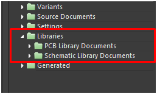
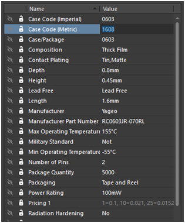
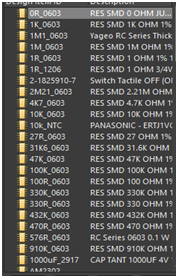
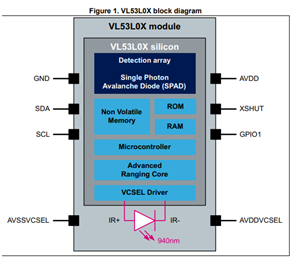
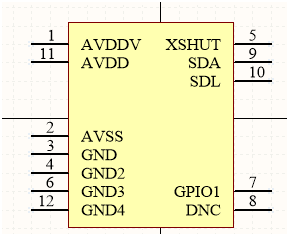

********
Símbolos
********

Simbolos
---------

-	Cada componente debe tener su símbolo y éste debe ser lo más descriptivo posible.
-	Los símbolos deben estar incluidos en una librería propia del proyecto y cada proyecto debe tener su propia librería. Esto mejora la portabilidad, es decir si el proyecto es controlado por varias personas todas poseen la misma librería dado que está incluida en el proyecto.

-   Agregar al componente toda la información adicional que sea posible y que
    sea de utilidad a la hora de fabricar la placa (Valor, footprint,
    fabricante, número de parte, distribuidor, etc).
	
	
	

	
	
	

-   Crear un símbolo por cada tipo de componente, valor y encapsulado , es decir
    crear un símbolo para un resistor de 1k 1/8W, otro para un resistor de 1k
    1/4W, etc. Esto si bien genera una librería más grande dado que se tiene un
    símbolo por cada componente, cada valor y cada footprint, ahorra tiempo a la
    hora de generar la BOM (Bill Of Materials - Lista de materiales). Generar
    una BOM clara y ajustada a los estándares de los fabricantes puede llegar a
    ser un proceso engorroso y demandante en caso de tener un único símbolo para
    todas las resistencias y todos los valores por ejemplo.

-   Para los Circuitos integrados no hace falta respetar la disposición de pines
    de la hoja de datos, si no que es más eficiente ubicar los pines de manera
    que genere un esquemático más organizado y sencillo a la vista. En lo
    posible tratar de mantener las entradas del lado izquierdo y las salidas del
    lado derecho.

   
  
   

*Disposición de pines de la hoja de datos                  Disposición de Pines
Ordenado*

FootPrints
-----------

-   Generar un footprint por cada tipo de encapsulado y repetirlo en los
    distintos símbolos esquemáticos. Es decir crear un footprint TO-92 y
    utilizarlo para el BC548, BC337, etc.

-   Cada footprint debe contener idealmente como mínimo las siguientes capas:

    1.  Top y Bottom layer: Capas para la ubicación de Pads y ruteado de pistas.

    2.  Top y Bottom Overlay: Capas para serigrafía. Cada footprint debe tener
        una serigrafía clara y representativa del componente y su forma,
        tratando de respetar las dimensiones físicas.

    3.  Top y Bottom Drawing: Estas capas se utilizan para delimitar el tamaño
        total ocupado por el componente. Se utilizan para visualizar una posible
        colisión de componentes.

        

    4.  Capa 3d: Asignar alguna capa mecánica al modelo 3d del Componente y
        respetarla para todos.

        

        
