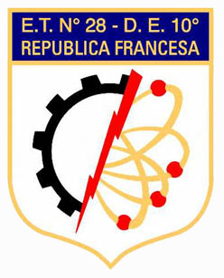
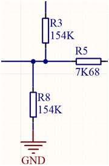

   

Tips Esquemático
---------

-   Los esquemáticos deben ser leídos de izquierda a derecha, es decir las
    entradas deben ser colocadas a la izquierda y las salidas a la derecha.  
	

-   En la medida de lo posible, separar el circuito en distintos esquemas
    independientes permitiendo la reutilización de circuitos. Por ejemplo un
    proyecto fácilmente puede ser separado en los siguientes esquemáticos:  
    
	

    1.  Alimentación  
	

    2.  Microcontrolador  
	

    3.  Sensor 1  
	

    4.  Sensor 2  
    
    
    5.  Etc.
	

Información 
---------

-   Agregar al esquemático toda información extra que pueda ser de utilidad. Por
    ejemplo: Títulos, Tablas de valores , indicaciones de soldado de algún
    componente o cualquier tipo de información que sea de utilidad a la hora del
    soldado o armado del PCB.  

-   Los componentes deben presentar de manera visible su información mínima , y
    el resto debe quedar oculta. Esto se hace para reducir información
    innecesaria a la hora de leer un esquema. Por ejemplo es común en los
    esquemáticos ver  
	

    1.  Número de componente  
	

    2.  Valor  
	

    3.  Footprint  
	

Y el resto de la información (Fabricante, número de pieza, etc) permanecerá
oculta.  

-   En el caso de separar el diseño en distintos esquemas generando un esquema
    de jerarquías, los conectores de entradas y salidas deben ir en el
    esquemático principal. Esto ayuda a entender cuales son las entradas y
    salidas del PCB de manera más rápida y sencilla.  
	

  

-   Tratar de mantener los esquemas sencillos y ordenados, y no generar
    “esquemáticos laberintos”.

-   Identificar los “cables” con NETS o nombres de manera que esos nombres se
    trasladen al PCB.

-   Si hay algún componente que, de manera obligatoria, debe ir cerca de otro
    componente indicarlo en el esquemático de alguna manera. Colocándolos juntos
    por ejemplo.

Alimentación
---------

-   En la medida de lo posible identificar las distintas tensiones de la
    siguiente manera:

    ** +/- XVY **  
	
	Donde:

	-   X es el valor entero de la tensión

	-   Y es el valor decimal de la tensión

	-   \+/- Indica la polaridad de la fuente

	Ejemplo: +3V3, +5V , -3V3.

   Esto se hace así dado que algunos CAD permiten filtrar elementos por nombre y aplicar distintas reglas a los nombres elegidos. 
   El signo delante del valor de tensión optimiza la búsqueda de nombres.

  

Conexiones
---------

-   En caso de tener más de tres conexiones en un mismo nodo, evitar la conexión
    en cruz dado que alguno de los cables podría no estar realmente unido y no
    nos daríamos cuenta. Separa las conexiones.

  

  

  
