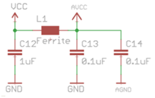
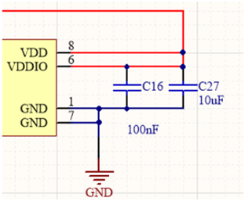
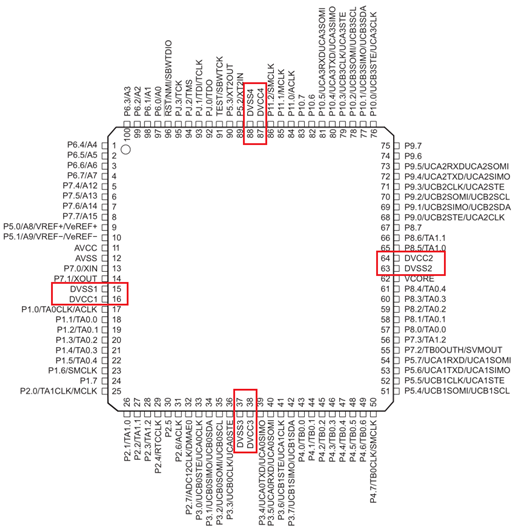
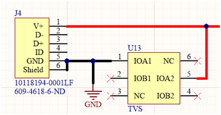
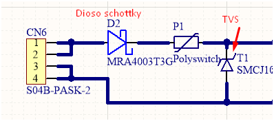
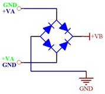

.. image:: media/img/escudoet28
   :align: right
   :scale: 30 %
   
   
Tips de Diseño de HW
=====================

-   En lo posible “uniformizar” los valores de los componentes cuando esto sea
    posible. Es decir, tratar de usar poca variedad de valores en el caso de los
    resistores y capacitores. Esto se hace para reducir costos en una
    producción, facilitar el montaje y reducir los errores del mismo.

    Por ejemplo: si se utiliza un resistor de 12k, otro de 10k y uno de 8k2 como
    pull up, es preferible que todos sean de 10K en vez de tener tres valores
    distintos, simplificando la compra (hay reducciones de costo en cantidad de
    un mismo valor) y haciendo más sencilla la selección de componentes para el
    montaje.

-   Leer las notas de aplicación y guías de diseño de los fabricantes de los
    circuitos integrados. En las mismas suele haber advertencias e indicaciones
    sobre el correcto uso y conexionado, que es importante respetar para no
    tener inconvenientes.

-   Utilizar los conectores globales del circuito (GND, Vcc, Vdd, etc.) para
    evitar líneas muy largas o que se crucen con otras. Además, esto permite un
    mejor seguimiento de las señales del circuito. Es recomendable además, poner
    las flechas que representan Vcc apuntando hacia arriba y las de GND hacia
    abajo.

-   En caso de tener circuitos digitales y analógicos en el mismo hardware (lo
    cual puede producir variaciones de frecuencia), tratar de separar los
    circuitos y las masas mediante bobinas de choque (inductores que presentan
    una reactancia muy grande a determinadas frecuencias).

-   De la misma manera, cuando se pretende manejar frecuencias superiores
    300MHZ, es indispensable separar las masas de los circuitos integrados y
    sensores con bobinas de choque, para aislarlos del posible ruido de alta
    frecuencia.

-   Siempre poner dos capacitores en paralelo con la alimentación de cada
    integrado, uno de bajo valor \~100nF y otro de mayor valor \~10uF (cerámicos
    multicapa), esto se hace para filtrar el posible ruido de alimentación en
    cada integrado (capacitores de desacople).

    En caso de tratarse de un microcontrolador, puede llegar a tener varios
    pines de alimentación que energizan distintos módulos:
	

	
	
>   Se debe colocar capacitores de desacople para cada pin de alimentación.
>   También se recomienda el uso de capacitores de tantalio en los casos donde
>   sea crítico filtrar el ruido de alimentación. Usualmente 4.7uF de tantalio
>   (tendiendo en cuenta el voltage de trabajo).

-   Siempre que se posean conectores externos, proteger cada línea del conector
    con TVS (Diodos supresores de voltaje) para prevenir picos de tensión
    indeseados.
	

-   En caso de utilizar alimentación externa mediante un conector, colocar un
    diodo schottky en serie con la alimentación para evitar la inversión de
    polaridad (Ya que si se conecta al revés la alimentación pueden dañarse los
    componentes de la placa ).

>   Otra posibilidad, si el circuito lo permite, es colocar un puente de diodos
>   en la entrada de alimentación de continua; de esta forma no hace falta
>   preocuparse por la polaridad de conexión.  

-   Colocar capacitores de alto valor (\~1000uF) a la salida de los reguladores
    o fuentes de alimentación nunca está de más. OJO: No colocar un valor
    demasiado elevado debido a la corriente inicial de carga demandada por dicho
    capacitor.

-   En caso de utilizar sensores o conectores que puedan estar conectados fuera
    del PCB es recomendable la aislación de las entradas al microcontrolador
    mediante optoacopladores.

-   En caso de utilizar tensiones elevadas utilizar optoacopladores para separar
    la lógica de los circuitos de potencia.

    Aislar siempre las etapas de lógica de las etapas de potencia mediante
    circuitos optoaislados o que garanticen una aislación galvánica.

-   En la medida de lo posible colocar leds en cada alimentación para indicar el
    correcto funcionamiento de las mismas.

    De no ser posible el uso de leds, colocar puntos de prueba (test points)
    para verificar el correcto funcionamiento.

-   En caso de utilizar pulsadores no olvidar incluir capacitores de “anti
    rebote” en paralelo y complementarlo mediante el firmware.

---------------------------------------------------------------------------------------------------

PCB: Consideraciones prácticas
==============================

En esta apartado se detallarán distintas consideraciones a tener en cuenta a la
hora de diseñar el PCB. Por tal motivo se recomienda la lectura del documento
**Criterios de Diseño de PCB** visto en taller de electrónica

Consideraciones Generales
--------------------
-   Lo primero que se debe hacer es dimensionar el tamaño y forma de la placa en
    base al gabinete o lugar donde se colocara el PCB.

    -   Colocar agujeros de fijación acordes al tipo de anclaje del PCB

    -   Los agujeros de fijación deben tener una corona de cobre que haga
        contacto con la tuerca, en caso de que se sujete con tornillo y tuerca.

	
	.. image:: ../media/img/pcb1.png
	   :align: center
	   :scale: 100 %  	

 
    -   Siempre es bueno limitar el área efectiva para ruteo en un tamaño menor
        al área total del PCB, \~1mm o menos. Esto se hace para que no queden
        pistas muy cerca de los bordes del PCB. A continuación se muestra una
        imagen de referencia donde el contorno verde indica las dimensiones del
        PCB y el perímetro rosa indica el área donde está permitido rutear el
        PCB.

	.. image:: ../media/img/pcb2.png
	   :align: center
	   :scale: 100 %  	
	

    -   Comenzar a trazar pistas una vez estén colocados todos los componentes
        en su posición.

    -   Siempre mantener las pistas lo más cortas posibles.

    -   En caso de realizar un diseño en más de una capa, seleccionar y mantener
        una simetría de ruteo y respetarla.

        Es decir, en un diseño de PCB de dos capas (Top y Bottom), seleccionar
        una simetría por ejemplo:

        -   Top ruteo horizontal.

	.. image:: ../media/img/pcb3.png
	   :align: center
	   :scale: 100 %  	 	

		-   Bottom Ruteo Vertical.

	.. image:: ../media/img/pcb4.png
	   :align: center
	   :scale: 100 %  	 	

>   Lo mismo se mantiene para N cantidad de capas.

Cristal para un microcontrolador
-----------------------

-   Si bien los capacitores que acompañan al Cristal (C1 y C2) ayudan a
    estabilizar la frecuencia de oscilación, también forman parte de una red de
    adaptación y la misma debe estar entre los circuitos a adaptar.

    -   Ambos capacitores deben estar lo más cerca posible entre sí y sus
        respectivos pines.

    -   El capacitor conectado a OSC1 debe ir primero.

    -   Los capacitores deben ser de baja pérdida y estables a la variación de
        temperatura (COG).

    -   Algunos microcontroladores poseen internamente dichos capacitores y sólo
        hace falta colocar el cristal (verificar en las hojas de datos del
        microcontrolador).

    -   El cristal debe estar alejado de fuentes de alta frecuencia, líneas de
        clock, líneas de conmutación.

    -   Las pistas deben ser lo más cortas posibles.

    -   Anillo de protección.

Conectores polarizados
-----------------
Si hay conectores que involucran alimentación (típicamente un conector para un
sensor que tiene líneas de alimentación y líneas de datos) es importante que los
mismos sean del tipo “polarizado”, es decir, que solo puedan (físicamente)
conectarse en la forma correcta, ya que de conectarse de otra forma podría
ocasionar daños a la placa o a aquello que conecta.

Fuentes Switching
-----------------
-   Las fuentes switching deben ocupar el menor lugar físico posible debido a la
    naturaleza ruidosa de las mismas, es decir, los componentes se colocan lo
    más cerca posible para evitar la propagación de ruido por el PCB. En
    especial el nodo de realimentación.

    -   Colocar la fuente switching en alguno de los extremos del PCB, alejado
        de los circuitos integrados que sean susceptibles al ruido, por ejemplo
        el microcontrolador.

    -   Priorizar la reducción de espacio frente a la alineación de componentes
        en las fuentes switching. Es decir los componentes pueden no estar
        alineados.

    -   Tratar de que el nodo de realimentación de la fuente quede “apuntando”
        hacia afuera del PCB. Esto es debido a que dicho nodo es la parte más
        ruidosa de la fuente.
