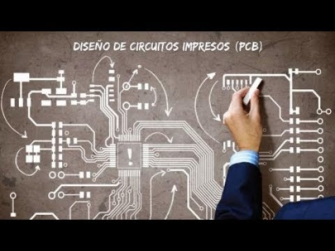

.. Recomendaciones PCB

***************
Index
***************

Objetivos
---------
En el presente documento se detallan distintos tips, consejos y recomendaciones
para el buen diseño de Hardware, abordando desde reglas de diseño básicas, tips
para un buen placement de componentes en el PCB, la creación de los componentes
con sus símbolos y footprints hasta su posicionamiento y ruteo dentro del PCB.
Los temas aquí presentados no hacen referencia a ningún CAD de diseño de PCB
específico si no que se aborda el tema desde un punto de vista genérico y en
caso de utilizar alguna funcionalidad puntual de un CAD específico se hará la
mención correspondiente.

Cabe destacar que este documento fue creado bajo la premisa de “consejos y tips”
y está basado en los conocimientos y experiencias de los autores, no debe ser
tomado como obligatorio a menos de que sea explícitamente indicado.

Datos del documento
-------------------
.. toctree::
   :maxdepth: 3
    rotulo

.. csv-table:: Recomendaciones y buenas costumbres para el diseño de PCB
   :widths: 20, 50

   "Espacio/s ",  "Laboratorio de Mediciones y Ensayos / Prácticas Profesionalizantes"
   "Autor/es",  "Foltyn, Pablo Andrés 	 /  Dominici, Juan Manuel	 / Alberino, Sergio "
   "Destinatarios", " Alumnos de 5to 6to año de la Especialidad Electrónica!"

.. toctree::
   :maxdepth: 2
   :caption: Componentes
   
    Símbolos <componentes/simbolos.rst>
    FootPrints <hardware/footprints.rst>

  

    Troubleshooting
    Support
    FAQ
    Licence
